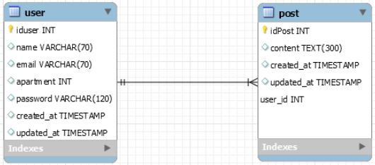

<h1 align=center> Projeto Parrot HandsOn 4 - Grupo 03 </hi>  

  

---

👇 Clique aqui 👇

  

## 💻 Sobre o projeto

 
##- FRONT-END
Os desenvolvedores do front-end criaram as páginas com base no layout utilizando Bootstrap, Styled-components React e Redux.

1. Login
a. Dados: email e senha
2. Cadastro do Usuário
a. Dados: Nome, email, senha, unidade/apartamento
3. Feed (criar post, listas todos os posts)
4. Página do usuario (posts do usuário)

##- BACK-END
Os desenvolvedores do back-end serão responsáveis por construir a API utilizando TypeScript, Node.js, Express, Jest, Sequelize, MySQL e Arquitetura Limpa.

1. Criação de banco de dados com base no DER
2. API Rest com CRUD para usuários e publicações
3. Autenticação de usuário
4. Implementar Princípios SOLID na arquitetura
5. Testes automatizados

- Projeto desenvolvido durante o desafio **Hands On 4** oferecido pela **Gama Academy**.

---

## :wrench: Como usar a API:

1. Após clonar o repositório, executar o comando `npm install` ou `yarn install`.
2. Criar um arquivo `.env` e alterar a conexão do banco de dados com as seguintes instruções:
- DB_HOST="local irá rodar o servidor, por padrão usamos localhost"
- DB_PORT="a porta do seu mysql, por padrão usamos 3306"
- DB_USER="nome de usuario do seu mysql"
- DB_PASS="senha do seu usuario mysql"
- DB_NAME="parrot"
- JWT_SECRET="criar senha com caracteres validos"
- PORT="porta que o servidor vai rodar. Ex: 3000"

3. Criar banco de dados sem tabelas no seu mysql.
4. Utilize o comando `npm run migration:run` para criação das tabelas no seu banco de dados.
5. Use o comando `npm run dev` ou `yarn dev` para iniciar sua conexão com o servidor
6. Caso tudo tenha dado certo, você está prontx para testar a API, caso mão, revise o passo-a-passo

---

## :floppy_disk: Banco de dados

Para o processo de criação do banco de dados, utilizamos migrations, porém desenhamos antes os models 

---
## 🛠 Tecnologias

As seguintes ferramentas foram usadas na construção do projeto:
  

  
  
  
  
  
  
  
  
  
  
  

---

<h2> 👨‍💻 Contribuidores </h2> 

<h2>
<table align=center>
  <tr>

   <td align="center">  <a href="https://github.com/dreialcantara/"> Andrei Alcantara </a>
   </td>
   <td align="center">  <a href="https://www.linkedin.com/in/caiodocarmo/"> Caio Do Carmo </a>
   </td>
    <td align="center">  <a href="https://github.com/eduardohpb/"> Eduardo Henrique</a>
   </td>
    <td align="center">   <a href="https://github.com/jonasaugust1/"> Jonas Augusto </a>
   </td>
    <td align="center">   <a href="https://github.com/MatheusChucri"> Matheus Rinaldi </a>
   </td>
   
  </tr>
</table> </h2>

---
